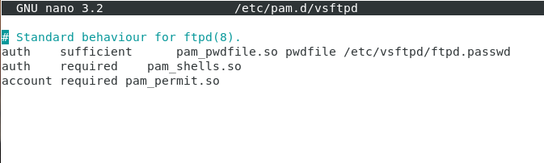
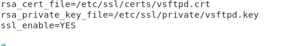

# VSFTPD

## Versión VSFTPD

## Usuario Creados en la Instalación

## Servicio Asociado

vsftpd.service

## Ficheros de configuración

/etc/vsftpd.conf

## Usuarios Enjaulados

Listen=YES

Chroot_local_user=YES

Chroot_list_enable=YES

Chroot_list_file=/etc/vsftpd.chroot_list

Allow_writeable_chroot=YES

Creamos el vsftpd.chroot_list
Los que esten dentro de vsftpd.chroot_list no estarán enjaulados

## Anonymous permiso de Lectura

Write_enable=YES

Local_umask=022

Anon_mkdir_write_enable=YES

Chown -R ftp:nogroup /srv/ftp

Chown -R ftp:nogroup /srv/ftp/sugerencias

Chmod 777 /srv/ftp/sugerencias

## Usuario virtual
/etc/vsftpd.conf

Htpasswd -cd ./ftpd.passwd usuariov

Mkdir /etc/vsftpd

Cp ftpd.passwd vsftpd

Apt instal libpam-pwdfile

Nano /etc/pam.d/vsftpd

Mkdir /etc/vsftpd/usersConf

Echo “local_root=/srv/usuariov” >/etc/vsftpd/usersConf/usuariov

Mkdir /srv/usuariov

## OpenSSL

openssl req -x509 -nodes -days 365 -newkey rsa:2048 -keyout /etc/ssl/private/vsftpd.key -out /etc/ssl/certs/vsftpd.crt

Para que deje entrar al usuario Anonymous hay que ponerle la directiva 

Allow_anon_ssl=YES

## Direcctivas Importantes

write_enable=YES Nos permite escribir.

local_umask=022 Nos permite dar nuevos permisos.

ftpd_banner Permite poner un banner al iniciar sesión.

chroot_enable=YES Activa el chroot, una medida de seguridad que sirve para enjaular los usuarios

chroot_list_enable=YES Habilita la chroot_list, es donde pondremos los usuarios que controlara chroot.

chroot_list_file=/etc/vsftpd.chroot_list Esta direcctiva indica la ruta del chroot_list, hay que crearlo ya que no existe por defecto
